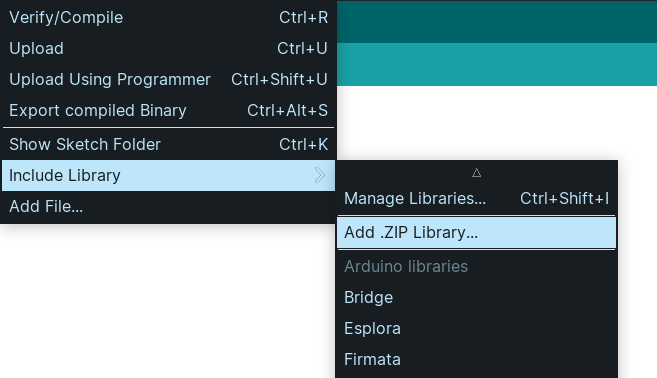

# Biblioteca laboratorioFW

## O que você encontra nesta biblioteca

Nesta biblioteca é possível encontrar o mapeamento entre a pinagem da placa Arduino Uno e a codificação dos pinos de ativação da placa [Laboratório de sistemas embarcados e IoT](https://github.com/Franzininho/laboratorio-SEIoT-Franzininho-Wifi) segundo o desenvolvido do [adaptador para Arduino](https://github.com/Franzininho/laboratorio-SEIoT-adaptador-arduino). Também é possível encontrar exemplos de utilização dos periféricos disponíveis na placa.

## Placas compatíveis com a biblioteca

-   Arduino Uno

## Como instalar a biblioteca

1. Faça o donwload da biblioteca em formato zip clicando em **Code** e depois em **Download ZIP**


2. Abra a IDE do Arduino
3. Vá em Sketch > Include Library > Add .ZIP Library



4. Selecione o arquivo zip baixado e clique em ok
5. Opcional: Procure pelos exemplos da biblioteca em File > Examples

## Como usar a biblioteca

Para utilizar a biblioteca basta incluí-la no seu arquivo de código com a linha `#include<laboratorioFW_ARDUNO.h>`. Depois disso, você pode utilizar os códigos dos pinos de ativação na placa dentro do seu código.

**Importante : Os algorismos do código do pino de ativação são separados por um caractere de `_`, ou seja o pino de ativação C0 pode ser acessado no código através do código C_0 e assim por diante.**

## Exemplo de utilização:

```c
#include <laborarotioFW_ARDUNO.h>

#define led A_1

void setup(){
    pinMode(led,OUTPUT);
}

void loop{
    digitalWrite(led,HIGH);
    delay(1000);
    digitalWrite(led,LOW);
    delay(1000);
}
```

## Informações importantes

-   [Mapeamento dos pinos](./informacoes/mapeamento.md)
-   [Exemplos disponíveis](./informacoes/exemplos.md)

---

#### Feito por [LelePG](https://github.com/LelePG)
